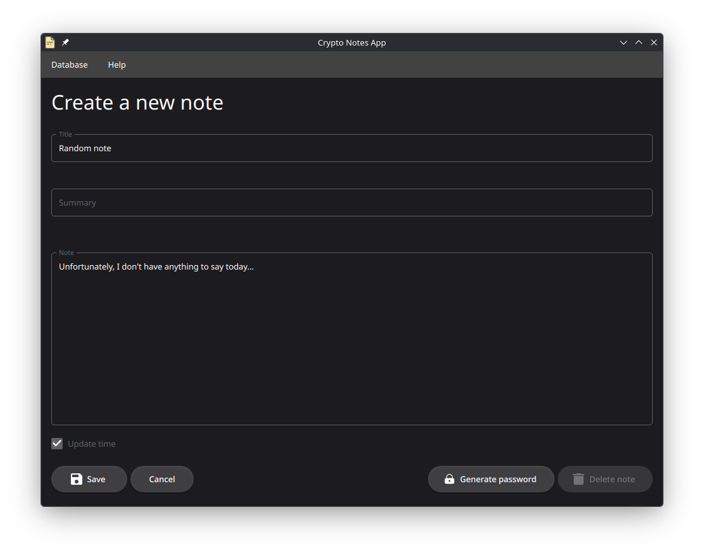

# Crypto Notes App
A desktop GUI application designed for storing encrypted text notes.

## Prerequisites
* C/C++ compiler
* CMake
* pkg-config
* Qt Core
* Qt Quick Controls 2
* OpenSSL
* SQLCipher

## Appearance


## Building
```
cmake -S . -B <build directory>
cmake --build <build directory> --target <crypto-notes or crypto-notes-cli>
```

## CLI usage
### Commands:
* ```help```
* ```dump <file>```
* ```recent```
* ```find <query>```
* ```details <id>```

### Column visibility flags:
* ```-id```
* ```-title```
* ```-summary```
* ```-time```

### Query example
```
./crypto-notes-cli find "My note" -id -title -summary
Master password: ****

| ID     | Title                | Summary                                          |
------------------------------------------------------------------------------------
| 2      | My note 2            | This is my second note                           | 
| 1      | My note              | This is my first note                            |

```
